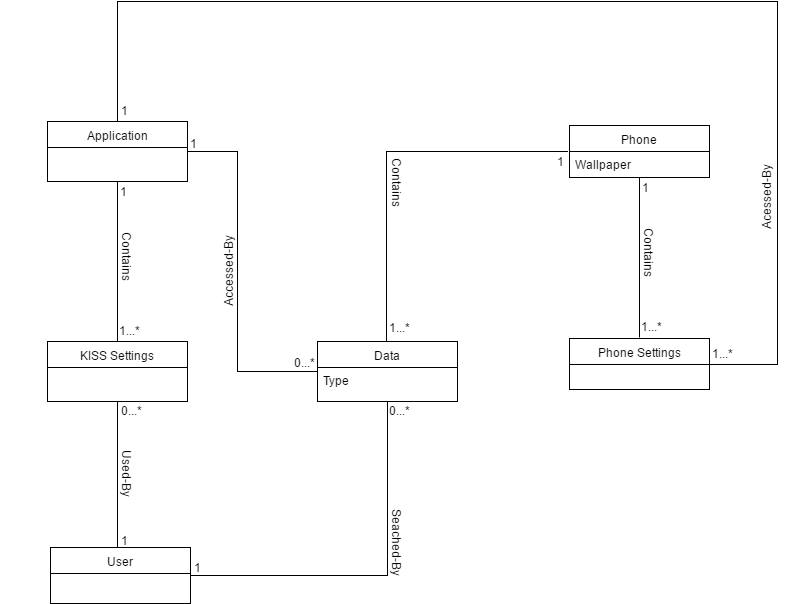

# KISS Launcher - Keep It Short and Simple

### Software Engineering - MIEIC

###### Grupo:
* Cláudia Margarida da Rocha Marinho - up201404493
* José Carlos Alves Vieira - up201404446
* Tiago Rafael Ferreira da Silva - up201402841

## Requirements

### Introduction
Before proceeding to the software development itself, it is needed to establish what are the conditions or capabilities that must be met by said software and that satisfy the user/customer needs. These conditions/capabilities are what we call software requirements.

Software Engineering is the process of studying customer and user needs so that it is possible to arrive at a definition of system, hardware and software requirements. It is essential to the success of software development. Neglecting this process will most likely lead to several problems that require a huge cost to fix, so it’s very important to define clearly what are the requirements of the software that is to be developed.

The process of gathering the requirements of a system from stakeholders (users, customers, etc.) is called requirement elicitation. Some of the most prominent requirement elicitation techniques include interviews, brainstorming, surveys, prototyping, etc.

### Purpose
As for “KISS Launcher”, the main purpose behind the development of this application was the creation of a fast launcher that focused on easy access rather than polished graphics. Instead of making the user scroll through icons while looking for whatever is needed (this is what usually happens with the android launcher), this application offers a fast and practical launcher with only a search bar that has access to everything that the user might need. This simplistic design is mostly inspired by command line interfaces.

Since the app was initially developed for the creator himself (Neamar), there’s not much to describe as problems of scope. He programmed what he had envisioned, so the purpose as to what needed to be done was pretty straightforward. He was an user who understood his needs (since he was both client and developer) and also the capabilities and limitations of the device.
The team behind the application makes many decisions. One of the most important (after the product is launched) is what to implement next.

The project leader can sometimes ask for new features or show preference for one in particular, but can also check the public opinion as to what is missing, what to improve and what to remove.

Considering that public opinion is usually not unanimous, there is a need to evaluate user’s opinions as a whole and determine what needs to be improved and what doesn’t.

Public opinions aside, when the leader of the app decides to implement a feature, he does it himself, sending the new version to the beta population.

But since it’s an open source application, the contributors might come up with something new and refreshing, and if the project managers like it, it will be merged onto the app.

### Specific Requirements and Features

#### Functional Requirements
* Work as a CLI (command line interface).
*	Be able to access all the apps/settings provided by the mobile phone.
*	Easy to use. No user would want a launcher that is clunkier than the one they already have.
*	Customizable, letting the user decide on the options that suits them best.

#### Non-Functional Requirements
* Run on any device, from new to old, from high-end to low-end.
* The graphical interface need to be as minimalist as possible. This is related to the first requirement, since nice UIs tends to be heavier and slower.
*	The package (APK) needs to be very small. Again, fast and light are the keywords here.
*	Be open source for everyone willing to help and improve the application.
*	Not require internet connection, which is good for the user privacy.
*	Use Java in order to be available for Android.

### Use Cases

#### Actors
* User
* Aplication

#### Use cases
* SearchData
* ExecuteApp
* ExecuteCall
* ExecuteMessage
* ExecuteSettings
* ShowApps
* AddToFavourites
* UninstallApp
* ExludeApp
* ExecuteGoogleSearch
* SetTheme
* AcessKISSsettings
* ResetHistory
* ResetFavourites
* ShowIncomingSMSinHistory
* ResetExcludedAppList
* ViewExcludedApps
* SortOrder
* KeyboardOnStart
* EnableSpellCheck
* UpdateWallpaper
* AcessPhoneSettings
* WifiSettings
* BluetoothSettings

#### System
* KISS

The user (actor) can search data using KISS (system). He can execute apps, messages, calls, settings, add to favourites, uninstall an app, exclude it, or execute a google search. For these actions to be performed, the user always has to search the data available on their phones.

The user can also set the theme, reset history, reset their favourite list, show messages in history, view apps he has excluded, define his favourite sorting method, change if the keyboard is showing on start, or enable spell check. Although, all these can only be accessed and modified if the user first accesses KISS settings.

The user can also update the wallpaper.

He can change wifi settings or bluetooth settings, but first he must access the phone settings.

Finally, he can simply see the apps he has installed, and for that he can show the apps.

Since there are many settings that can be changed on a mobile phone, we’re only listing some of them. Listing all would be unnecessary for this work, because the use cases would grow quite a lot on size, growing always in the same way and without adding value to the report.

(enlarge: right click -> open image in new tab)

### Domain Model
As we've already stated through out this report (and the previous one), KISS is an android launcher. As such, there are only three main interactions the user has with the app: access KISS settings, access the phone's data and access the phone's settings.

This can be better observed in the following diagram.

(enlarge: right click -> open image in new tab)

## Contributions
Every group member worked evenly in order to create this report.
