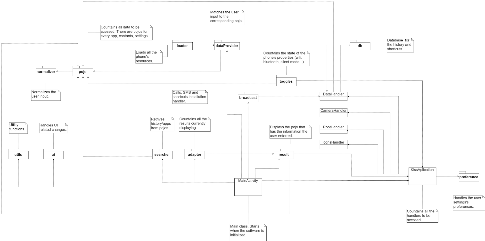
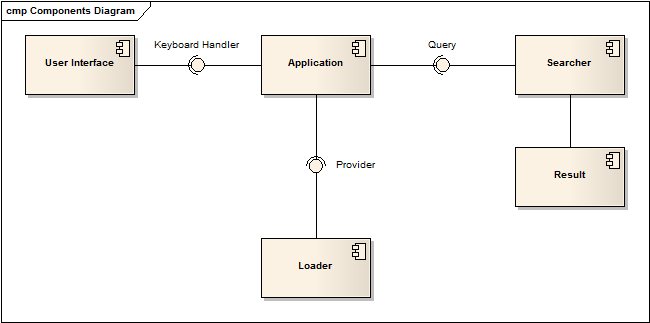

# KISS Launcher - Keep It Short and Simple

### Software Engineering - MIEIC

##### Group:
* Cláudia Margarida da Rocha Marinho - up201404493
* José Carlos Alves Vieira - up201404446
* Tiago Rafael Ferreira da Silva - up201402841

## Software Design

### Table of Contents
* [Introduction](#introduction)
* [4+1 View Model](#4+1-view-model)
* [Architectural Patterns](#architectural-patterns)
* [Logical View](#logical-view)
* [Development View](#development-view)
* [Deployment View](#deployment-view)
* [Process View](#process-view)
* [Contributions](#contributions)

### Introduction
Software architecture is extremely important. It allows the programmer to see the structure of the software and the connections between the different components as a whole. It also displays how the software itself is built, since it's following a specific design in order to run properly and efficiently.

We can specify the design the software follows. To do this, the software functionalities are divided into components which can then be reused, and these components can be divided into classes, which contains information and functions that ultimately makes the program behave as it's supposed to.

### 4+1 View Model

##### This model is composed of 5 views:
* Use Case View - Done in the last report.
* Logical View - Diagram that shows abstractions in the system as objects, classes, or even packages. Since the project we're working on is fully developed in Java, this diagram will use the project's packages and some of the most important classes in order to be better understood.
* Implementation View - Diagram based on the relationships and dependencies between components.
* Deployment View - Diagram illustrating resources (hardware) the software needs in order to run, and how the components are distributed around it.
* Process View - Diagram showing the interactions and flow of the system's processes.

### Architectural Patterns

Since our project didn't follow a software process, it's likely it doesn't follow an architectural pattern too.

It doesn't follow a Model-View-Controller Architecture. All of the code is connected, all the packages can interact with all the others. It certainly has classes and packages only related with UI and presentation, but they're not independent enough to be able to change easily without changing code in packages unrelated with the presentation.

It's doesn't follow a Layered Architecture, since there's no layers implemented, just packages that have classes and those classes can interact with any other class in the project. It doesn't have an architecture in which there is abstractions that use more specific and concrete functions, because all the services every class provides can be accessed by any other class in the whole project.
Since it's a full Java project, we don't think there was a great need to structure the project into layers, because it's quite easy to access all information this way (specific or not so specific). Besides, providing a layer structure in this kind of projects can be very hard and, as we said above, not that necessary.
One last note about this architecture is that, since there's many layers, processing may be slower (due to the multiple levels in interpretation), which goes against the project's policy of being fast and efficient.

It doesn't follow a Repository Architecture. There' s no large volumes of data to be stored/shared (the software only access what the mobile phone has in the moment), and there's no need to divide the few existing components into subsystems.

It doesn't follow a Client-Server Architecture. We can see similarities, such as the user typing a contact's name in the search bar, and the software, based on the name the user provided, searches the contact in the database and returns the information and call options for that contact.
The similarities stop there, since all accesses are made in one location (the user's phone), and there's no need for a server. The basic idea of providing information for the software to search in the database, and the software returning with a result, is the only similarity with this type of architecture.
There was no need to use this architecture, since the software has no need for servers and has only one access point.

So, what's the architecture being used here? A custom made one, which tries to get the best possible result in terms of memory usage and CPU consumption.
It's probably not the best idea not having a specific architecture for the software to follow, but the information regarding the project's structure in their [GitHub](https://github.com/Neamar/KISS/blob/master/CONTRIBUTING.md#how-does-it-work) is a good starting point to understand how the project is structured.

### Logical View

The Logical View (or Package Diagram) shows the packages based on the implementation logic, describing the dependencies between them.

KISS is divided into 13 packages, but in order to better describe their logic, some critical classes were introduced in the diagram.

(enlarge: right click -> open image in new tab)

### Development View

The Development View (or Implementation View, or Component Diagram) shows the software components and the
dependencies among them.

The user inputs are handled by the user interface which resorts to the keyboard handler interface to interpret them. The user inputs are then used by the application that will make queries to the searcher, using the query interface. The query interface will allow searches for different type of data (application, contacts, etc.) and the answer to the queries will be given in result. The data will be provided through an interface called Provider.

(enlarge: right click -> open image in new tab)

### Deployment View

The Deployment View (or Deployment Diagram) shows hardware nodes, communication relationships and software artifacts deployed on them.

Since KISS is an android application whose main focus is on speed and efficiency, it doesn't require much in terms of hardware. An android device with the version 2.25 or higher is all it takes to run KISS.

(enlarge: right click -> open image in new tab)

### Process View

The Process View (or Activity Diagram) shows the processing steps, data/object stores, data/object-flows, and the opportunities for parallelization.

Since it's possible to execute many different actions within KISS, the following diagram will focus on its main features: the search bar and the main menu.

(enlarge: right click -> open image in new tab)

## Contributions
Every group member worked evenly in order to create this report.
